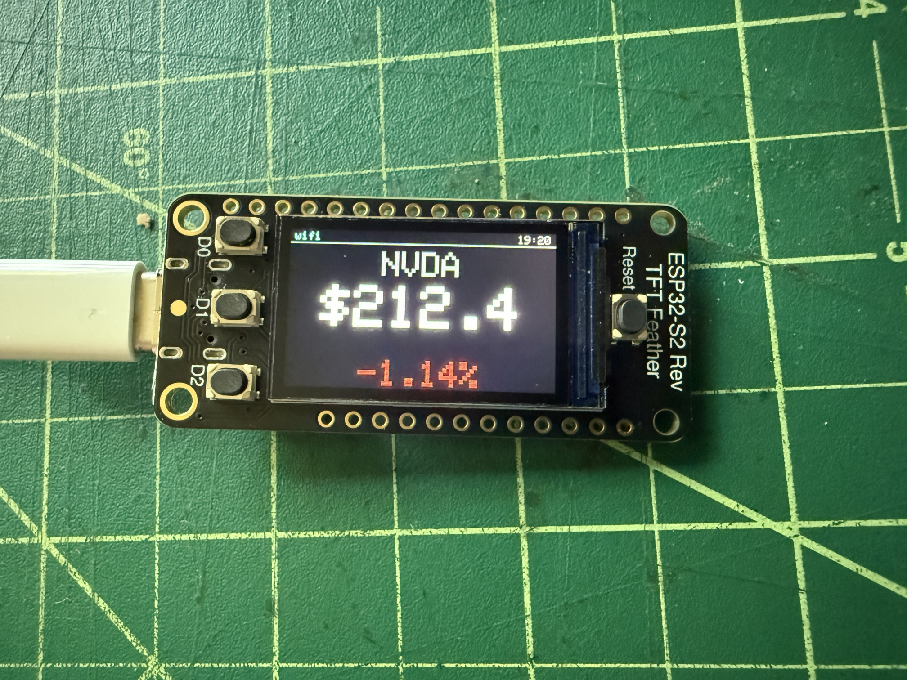

# display-stock



ESP32-S2 firmware that turns an [Adafruit Feather ESP32-S2 Reverse TFT](https://www.adafruit.com/product/5345) into a desktop stock ticker. Rotates through a configurable list of symbols, showing price and daily percent change on the 240×135 TFT.

## Features

- First-boot captive-portal setup: collects wifi credentials, the symbol list, and per-symbol dwell seconds in one form
- Quotes from Yahoo Finance, refreshed every 60 seconds
- Auto-rotation with manual prev/next via the side buttons
- NTP-synced clock and wifi indicator in a small status bar
- Stale-data marker if a symbol fails to refresh
- Hold the BOOT button for two seconds at power-on to wipe config and re-enter setup

## Hardware

- [Adafruit Feather ESP32-S2 Reverse TFT](https://www.adafruit.com/product/5345) (240×135 ST7789, three user buttons, native USB)
- USB-C cable

## Build & flash

Requires [PlatformIO Core](https://platformio.org/install/cli).

```sh
# Build only (no upload)
pio run

# Build + upload (waits for the board to appear on /dev/cu.usbmodem*)
scripts/flash.sh

# Open the serial monitor
scripts/monitor.sh
```

### ESP32-S2 bootloader gotcha

The S2 has native USB instead of a USB-to-serial chip, so the automatic `1200bps`-reset trick PlatformIO uses to drop into the bootloader is unreliable. If `scripts/flash.sh` fails with `Failed to connect to ESP32-S2: No serial data received`, put the board into ROM bootloader mode manually:

1. Hold **BOOT** (the D0 button)
2. Press and release **RESET** while still holding BOOT
3. Release BOOT

The port name will change (e.g. `/dev/cu.usbmodem101` → `/dev/cu.usbmodem01`). Re-run `scripts/flash.sh`; press **RESET** once when it finishes to run the new firmware.

## Fonts

The display renders in **Helvetica Neue**, converted to Adafruit-GFX bitmap fonts. Because Helvetica Neue is Apple's proprietary font, neither the source `HelveticaNeue.ttc` nor the generated headers (`src/fonts/HelveticaNeue*pt7b.h`) are committed — they're gitignored. Only the hand-written aggregator `src/fonts/helvetica_neue.h` is tracked.

So after cloning you must generate the font headers once before building:

```sh
# 1. Provide the font (macOS ships it):
cp /System/Library/Fonts/HelveticaNeue.ttc .

# 2. One-time tooling:
brew install freetype
pip3 install fonttools

# 3. Fetch the Adafruit GFX library (which carries fontconvert), then generate:
pio run                 # populates .pio/libdeps (safe to interrupt after it resolves deps)
scripts/gen_fonts.sh    # writes src/fonts/HelveticaNeue{Regular8,Medium10,Bold15,Bold26}pt7b.h
```

`scripts/gen_fonts.sh` builds Adafruit's `fontconvert`, splits the three weights it needs out of the `.ttc` (fontconvert only reads face 0 of a file), and rasterizes them. The four faces, and where they're used:

| Header | Weight / size | Glyphs | Used for |
|---|---|---|---|
| `HelveticaNeueRegular8pt7b` | Regular 8pt | full ASCII | status bar, hints |
| `HelveticaNeueMedium10pt7b` | Medium 10pt | full ASCII | headers, boot screens |
| `HelveticaNeueBold15pt7b` | Bold 15pt | full ASCII | ticker symbol, % change |
| `HelveticaNeueBold26pt7b` | Bold 26pt | `$`–`9` only | big price, countdown |

To restyle (different weights, sizes, or glyph ranges), edit the `fontconvert` invocations at the bottom of `scripts/gen_fonts.sh` and re-run it.

## First-boot setup

1. After flashing, the TFT shows `Setup mode` with an AP name and `192.168.4.1`.
2. From your phone or laptop, join the `StockTicker-Setup` open wifi network.
3. The captive portal page opens automatically. Pick your home wifi, enter its password, edit the symbol list (`AAPL,MSFT,GOOGL,NVDA,TSLA` by default), and set the seconds-per-symbol dwell (default `8`).
4. Save. The device reboots and starts displaying.

## Buttons

| Button | While running |
|---|---|
| **D0** (BOOT) | Force an immediate refresh |
| **D1** | Previous symbol |
| **D2** | Next symbol |
| **D0 held at boot for 2s** | Factory reset (clears wifi + symbols, re-enters setup) |

## File layout

```
src/
  main.cpp           top-level state machine + loop
  config.h           pins, colors, URLs, defaults
  storage.h/.cpp     NVS-backed config (symbols, dwell)
  wifi_setup.h/.cpp  WiFiManager wrapper + factory reset
  stock_fetcher.h/.cpp  Yahoo v8 chart endpoint client (one fetch per loop tick)
  display.h/.cpp     ST7789 drawing
  buttons.h/.cpp     debounced edge-triggered button events
  fonts/
    helvetica_neue.h   aggregator (tracked); includes the generated headers below
    HelveticaNeue*pt7b.h  generated GFX fonts (gitignored — see "Fonts")
scripts/
  flash.sh           wait for port, build, upload
  monitor.sh         wait for port, open serial monitor
  gen_fonts.sh       regenerate the GFX font headers from HelveticaNeue.ttc
  _wait_for_board.sh shared port-wait helper
```

## Caveats

- **Yahoo Finance has no official free API.** This uses the unofficial `query1.finance.yahoo.com/v8/finance/chart/SYMBOL` endpoint. It has been stable for years but could break at any time.
- **TLS uses `setInsecure()`** — no certificate validation. Reasonable for a personal device on a home LAN; do not deploy outside that threat model.
- Times shown are UTC by default. Edit `NTP_OFFSET_SECONDS` in `src/config.h` to use local time.

## License

No license declared. Add one if you want to make the code reusable.
